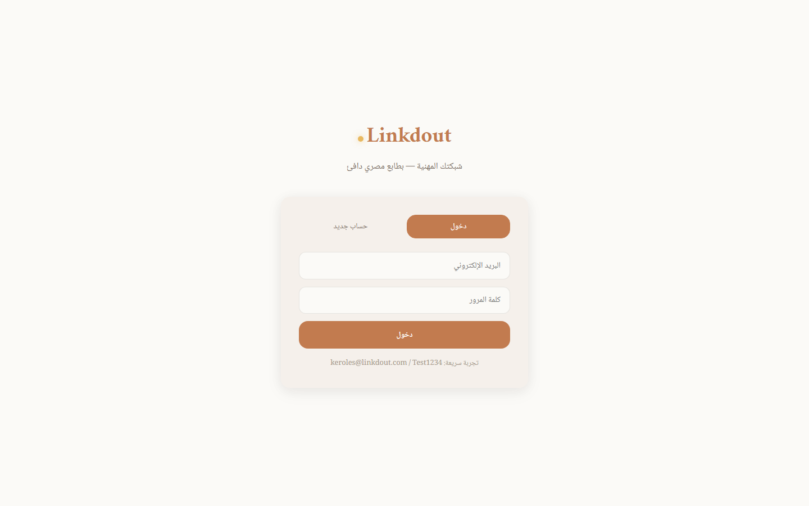

<p align="center">
  
</p>

<h1 align="center">Linkdout</h1>

<p align="center">
  <b>شبكتك المهنية — بالمصري 🇪🇬</b>
</p>

<p align="center">
  منصة احترافية مبنية عربي × RTL بالكامل، مستوحاة من LinkedIn. <br/>
  مش مجرد clone — ده LinkedIn بنكهة مصرية، تصميم دافيء، و backend قوي.
</p>

<p align="center">
  
  
  
  
  
  
</p>

---

## 📸 لقطات من المشروع

<p align="center">
  
</p>

<p align="center">
  <em>الصفحة الرئيسية — RTL بالكامل، شريط التنقل، Feed، بروفايل، فرص، واقتراحات</em>
</p>

<p align="center">
  
</p>

<p align="center">
  <em>الصفحة كاملة — التصميم الثلاثي الأعمدة وتفاصيل المنشورات والدوائر</em>
</p>

---

## 🧠 الفكرة

**Linkdout** هو منصة تواصل مهني (Professional Network) معمولة من الصفر — مش مجرد تمارين. الهدف إنك تبني شبكة علاقاتك، تشارك إنجازاتك، تلاقي فرص شغل، وتتواصل مع ناس في مجالك — وكل ده بواجهة عربية 100% واتجاه RTL.

المشروع معمول كـ **full-stack application** حقيقي:
- **Frontend**: Single-page app بـ HTML/CSS/JS — فيه بوستات، تعليقات، إعجابات، بروفايلات، سيرش، وإشعارات
- **Backend**: ASP.NET Core 9 Web API — JWT Auth + Cookies، MySQL، Response Compression، Output Caching
- **Admin Panel**: لوحة تحكم كاملة لإدارة المستخدمين والمحتوى

---

## 🛠️ التقنيات (Tech Stack)

### Backend
| المكون | التقنية |
|--------|---------|
| Language | C# 13 |
| Framework | ASP.NET Core 9 (MVC + Web API) |
| Authentication | JWT + Cookie-based dual auth |
| ORM | Entity Framework Core |
| Database | MySQL 8 |
| Caching | Output Cache + Response Compression (Brotli + Gzip) |
| API Style | RESTful with JSON camelCase |

### Frontend
| المكون | التقنية |
|--------|---------|
| Markup | HTML5 (Semantic) |
| Styling | CSS3 — Custom Design System، بدون frameworks |
| JavaScript | Vanilla JS — AJAX، DOM manipulation |
| Direction | **RTL بالكامل** — كل حاجة من اليمين للشمال |
| Fonts | Amiri, Noto Naskh Arabic, Playfair Display, Lora |
| Layout | CSS Grid — 3-column responsive |

---

## ✨ المميزات (Features)

### 🔐 المصادقة والأمان
- ✅ **تسجيل دخول** بالـ JWT + Cookies (dual authentication)
- ✅ **تسجيل حساب جديد** — اسم، إيميل، كلمة مرور، صورة
- ✅ **حماية الصفحات** — Authorization على الـ Controllers
- ✅ **Password hashing** — Secure storage

### 👤 الملف الشخصي (Profile)
- ✅ Cover photo gradient مخصص
- ✅ Avatar مع border و shadow
- ✅ إحصائيات: المتابعين، المنشورات، العلاقات
- ✅ Status badge: "متاح للعمل" 🟢 أو "يتعلم حالياً" 🟡
- ✅ Bio، headline، skills

### 📝 المنشورات (Posts)
- ✅ **إنشاء منشور** — نص + صورة + هاشتاجات
- ✅ **Composer** — شريط كتابة سريع من الـ feed
- ✅ **إعجاب ❤️ + تعليق 💬 + مشاركة 🔄**
- ✅ **Tags system** — تصنيف المنشورات
- ✅ صور في المنشورات مع lazy loading

### 🔵 الدوائر (Circles)
- ✅ مجموعات حسب الاهتمام (قريب، تعلم، مهني)
- ✅ عدد الأعضاء في كل دائرة
- ✅ تفاعل مع محتوى الدائرة

### 💼 الفرص الوظيفية (Opportunities)
- ✅ قائمة بالوظائف والفرص
- ✅ اسم الشركة، المسمى الوظيفي، التفاصيل
- ✅ فلترة وسيرش في الفرص

### 🏢 الشركات (Companies)
- ✅ ملفات تعريفية للشركات
- ✅ الوظائف المتاحة في كل شركة
- ✅ متابعة الشركات

### 🔍 البحث (Search)
- ✅ **Live search** في الـ navbar
- ✅ بحث في المنشورات، الأشخاص، الشركات
- ✅ نتائج فورية

### 🔔 الإشعارات (Notifications)
- ✅ Badge بعدد الإشعارات الجديدة
- ✅ إشعارات الإعجابات والتعليقات
- ✅ طلبات الصداقة

### 👥 شبكة العلاقات (Network)
- ✅ **اقتراحات أشخاص** — Suggested connections
- ✅ **إضافة صديق** — Connect button
- ✅ عدد العلاقات المشتركة

### 🛡️ لوحة التحكم (Admin Panel)
- ✅ إدارة المستخدمين
- ✅ إدارة المنشورات والمحتوى
- ✅ إحصائيات الموقع
- ✅ Seed data تلقائي

---

## 🏗️ هيكل المشروع

```
linkedout/
├── index.html                    # ⭐ Main SPA — 80KB frontend كامل
├── .gitignore
├── README.md
│
└── backend/
    ├── _test.js                  # اختبار الاتصال
    ├── add_admin_cols.py         # Migration scripts
    ├── add_cols2.py
    ├── add_cols3.py
    │
    └── Linkdout.Api/             # ASP.NET Core Web API
        ├── Program.cs            # Entry point + DI + Middleware
        ├── Linkdout.Api.csproj   # Project file (net9.0)
        ├── appsettings.json      # Config + ConnectionStrings
        ├── appsettings.Development.json
        │
        ├── Controllers/          # API + MVC Controllers
        ├── Models/               # Entity models
        ├── Data/                 # DbContext + Seed data
        ├── Views/                # Razor Views (MVC)
        │   ├── Account/          # Login / Register / Profile
        │   ├── Admin/            # Admin Dashboard
        │   ├── Circles/          # Circles management
        │   ├── Companies/        # Company pages
        │   ├── Groups/           # Groups
        │   ├── Home/             # Feed الرئيسية
        │   ├── Opportunities/    # Job listings
        │   ├── Profile/          # User profiles
        │   ├── Search/           # Search results
        │   └── Shared/           # Layouts + Partials
        │
        └── wwwroot/              # Static files (CSS, JS, images)
```

---

## 🚀 تشغيل المشروع

### المتطلبات

- [.NET 9 SDK](https://dotnet.microsoft.com/en-us/download/dotnet/9.0)
- [MySQL 8](https://dev.mysql.com/downloads/mysql/)
- أي متصفح حديث (Chrome, Firefox, Edge)

### خطوات التشغيل

```bash
# 1. انسخ الـ repo
git clone https://github.com/keroles-salah/linkedout.git
cd linkedout

# 2. اضبط الـ Connection String
# عدل الملف: backend/Linkdout.Api/appsettings.json
# حط بيانات الـ MySQL بتاعتك

# 3. شغّل الـ Backend
cd backend/Linkdout.Api
dotnet run

# 4. افتح المتصفح
# الرابط هيظهر في التيرمينال — غالباً:
# https://localhost:5001
# http://localhost:5000
```

> **ملاحظة:** قاعدة البيانات بتتعمل تلقائياً (Auto-migrate + Seed) — مش محتاج تعمل حاجة.

### الـ frontend منفصل

الـ `index.html` في root الـ repo هو تطبيق frontend مستقل — تقدر تفتحه مباشرة في المتصفح، أو تحطه في `wwwroot` بتاع الـ backend عشان يشتغل مع الـ API سوا.

---

## 🎨 التصميم (Design System)

التصميم معمول بـ **custom design system** — مفيش Bootstrap ولا Tailwind:

| العنصر | القيمة |
|--------|--------|
| Primary | Terracotta `#C27B4F` |
| Secondary | Gold `#E8B960` |
| Accent | Olive `#5B8C5A` |
| Dark | Navy `#1A1A2E` |
| Background | Cream `#FBFAF7` |
| Cards | Warm Gray `#F5F0EB` |
| Fonts | Amiri (عناوين) + Noto Naskh Arabic (نصوص) |
| Direction | **RTL** (من اليمين للشمال) |

الـ layout بيستخدم CSS Grid تلات أعمدة:
- **اليمين (280px):** بروفايل + دوائر
- **الوسط (flexible):** Feed + منشورات
- **الشمال (300px):** فرص + اقتراحات

---

## 📊 إحصائيات الكود

```
Language         Files       Lines
──────────────────────────────────
HTML                1        ~2,500
CSS          (inline)        ~1,200
JavaScript   (inline)        ~1,000
C# (Backend)        12+      ~1,400
Python               3         ~150
──────────────────────────────────
Total                        5,250+
```

> الأرقام تقريبية — الـ `index.html` 80KB لوحده بكل الـ CSS والـ JS inline.

---

## 🗺️ Roadmap

- [ ] **Real-time notifications** — SignalR WebSocket
- [ ] **Messaging/Chat** — Real-time messaging system
- [ ] **Post images upload** — Cloud storage integration
- [ ] **Endorsements & Skills** — LinkedIn-style endorsements
- [ ] **Mobile App** — React Native or MAUI
- [ ] **AI Recommendations** — Job/connection recommendations
- [ ] **Dark Mode** — 🌙
- [ ] **Deployment** — Deploy to Azure / Railway

---

## 👨‍💻 المطور

<p align="center">
  <b>كيرلس صلاح فخري</b> (Keroles Salah Fakhry)
</p>

<p align="center">
  <a href="https://keroles-sala.me"></a>
  <a href="https://github.com/keroles-salah"></a>
  <a href="https://www.linkedin.com/in/kerolessalah05/"></a>
  <a href="https://www.youtube.com/@kerlssalah"></a>
</p>

<p align="center">
  طالب Computer Science في Assiut National University<br/>
  مهتم بـ AI، Problem Solving، وبناء منتجات رقمية مفيدة<br/>
  <em>"Turning complex problems into elegant solutions."</em>
</p>

---

## 📝 License

MIT — حر في الاستخدام والتعديل والنشر. بس لو استفدت من المشروع، اعمله ⭐ على GitHub.

---

<p align="center">
  <b>⭐ Made with passion in Assiut, Egypt 🇪🇬</b>
</p>
