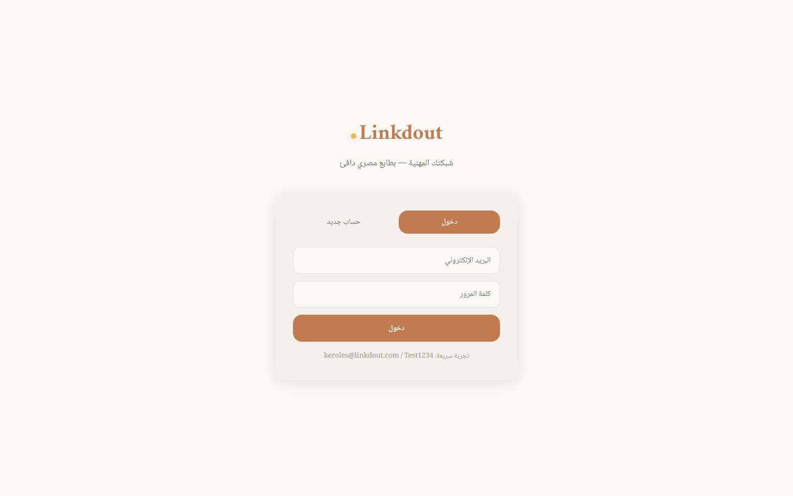
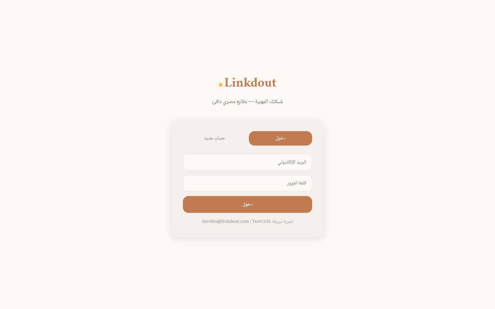
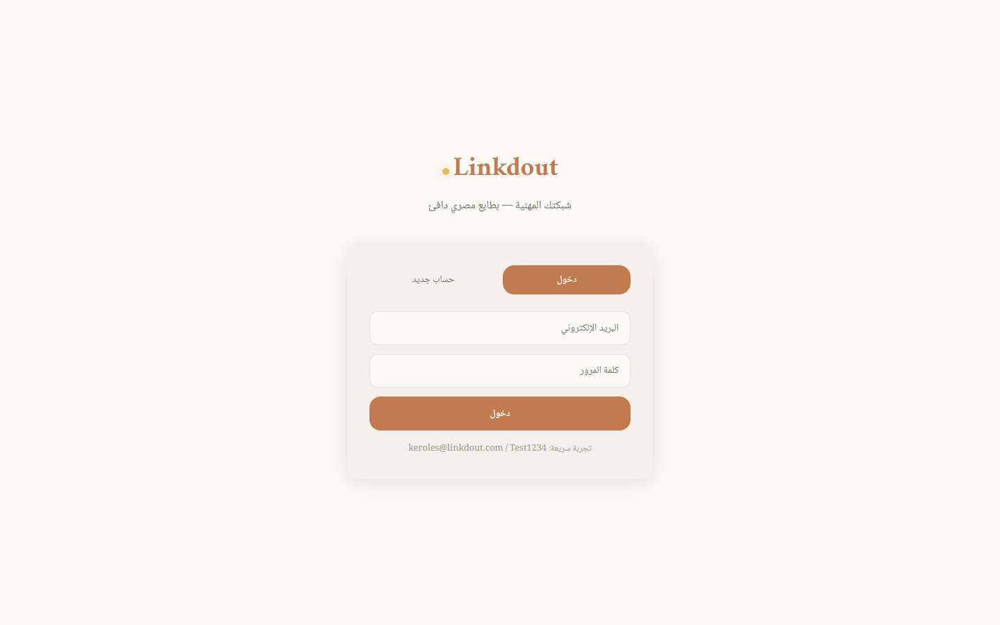
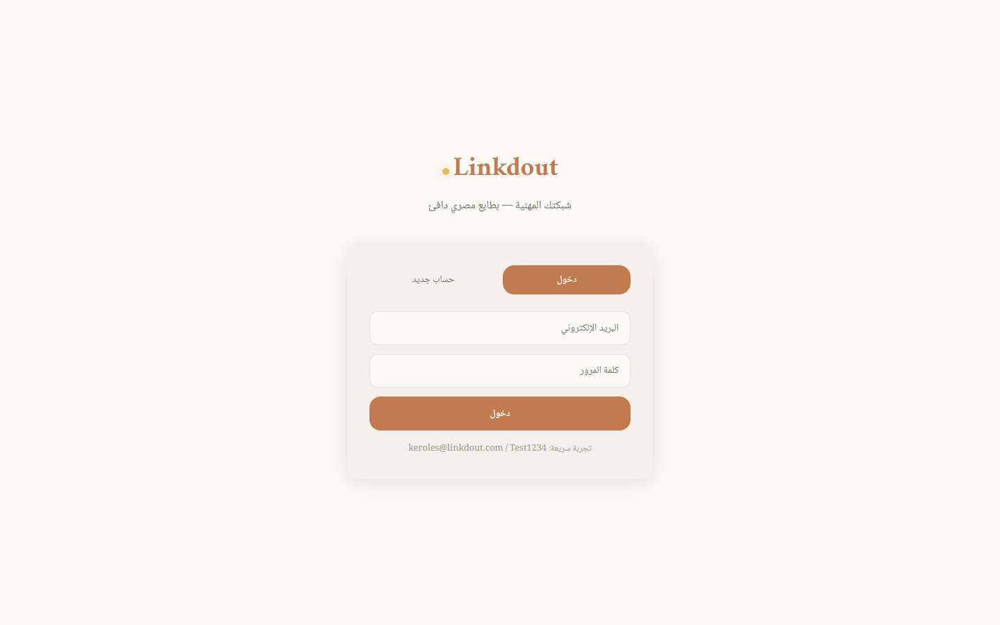

<p align="center">
  
</p>

<h1 align="center">Linkdout</h1>

<p align="center">
  <b>Your Professional Network — Built from Scratch 💼</b>
</p>

<p align="center">
  A full‑stack professional networking platform inspired by LinkedIn.<br/>
  Fully RTL Arabic interface, warm design system, and a real <b>ASP.NET Core backend</b>.
</p>

<p align="center">
  
  
  
  
  
  
</p>

---

## 📸 Screenshots

<p align="center">
  
</p>

<p align="center">
  <em>Homepage — RTL layout, sticky navbar, profile card, feed, and sidebars</em>
</p>

<p align="center">
  
</p>

<p align="center">
  <em>Post feed — composer, interactions (like · comment · share), and tags</em>
</p>

<p align="center">
  
</p>

<p align="center">
  <em>Multiple posts with engagement — likes, comments, and sharing</em>
</p>

<details>
<summary>📸 More screenshots (click to expand)</summary>

<p align="center">
  
  <br/><em>Full-page view — three‑column layout</em>
</p>

<p align="center">
  
  <br/><em>Profile card — cover photo, avatar, stats, status badges, circles</em>
</p>

<p align="center">
  
  <br/><em>Extended feed — more posts and right‑sidebar opportunities</em>
</p>

</details>

---

## 🧠 What Is This?

**Linkdout** is a real full‑stack professional networking platform — not a tutorial project.  
It lets you build your network, share achievements, find job opportunities, and connect with peers — all through a fully Arabic, right‑to‑left interface.

---

## 🛠️ Tech Stack

<p align="center">

| Layer | Technology |
|:-----:|:-----------|
| **Language** | C# 13 |
| **Framework** | ASP.NET Core 9 (MVC + Web API) |
| **Auth** | JWT + Cookie‑based dual authentication |
| **ORM** | Entity Framework Core |
| **Database** | MySQL 8 |
| **Caching** | Output Cache + Brotli/Gzip Compression |
| **API Style** | RESTful · JSON camelCase |

</p>

<p align="center">

| Layer | Technology |
|:-----:|:-----------|
| **Markup** | HTML5 (semantic) |
| **Styling** | CSS3 — custom design system, zero frameworks |
| **Scripting** | Vanilla JavaScript (AJAX, DOM) |
| **Direction** | Full RTL — every element right‑to‑left |
| **Fonts** | Amiri · Noto Naskh Arabic · Playfair Display |
| **Layout** | CSS Grid — responsive 3‑column |

</p>

---

## ✨ Features

### 🔐 Authentication
- ✅ Login with **JWT + Cookies** (dual auth)
- ✅ Registration — name, email, password, avatar
- ✅ Protected routes with `[Authorize]` attributes
- ✅ Secure password hashing

### 👤 Profile
- ✅ Custom gradient cover photo
- ✅ Avatar with border & shadow
- ✅ Stats: followers · posts · connections
- ✅ Status badges: "Open to Work" 🟢 · "Currently Learning" 🟡
- ✅ Bio · headline · skills

### 📝 Posts & Feed
- ✅ **Create posts** — text + image + hashtags
- ✅ **Quick composer** — write directly from the feed
- ✅ **Like ❤️ · Comment 💬 · Share 🔄**
- ✅ **Tag system** — categorize posts
- ✅ Inline post images

### 🔵 Circles
- ✅ Interest‑based groups (friends · learning · professional)
- ✅ Member count per circle
- ✅ Circle‑specific content

### 💼 Opportunities
- ✅ Job listings with company name · title · details
- ✅ Filter and search opportunities

### 🏢 Companies
- ✅ Company profiles
- ✅ Open positions per company
- ✅ Follow companies

### 🔍 Search
- ✅ **Live search** in the navbar
- ✅ Results across posts · people · companies

### 🔔 Notifications
- ✅ Unread badge counter
- ✅ Like & comment notifications
- ✅ Connection requests

### 👥 Network
- ✅ **Suggested people** to connect with
- ✅ **Connect** button with mutual connections count

### 🛡️ Admin Panel
- ✅ User management
- ✅ Content moderation
- ✅ Site analytics
- ✅ Auto‑seed data on first run

---

## 🏗️ Project Structure

```
linkedout/
├── index.html                    # ⭐ Main SPA — 80 KB frontend
├── logo.svg                      # Brand logo
├── README.md
├── screenshot-*.png              # Screenshots
├── .gitignore
│
└── backend/
    ├── add_admin_cols.py         # DB migration helpers
    ├── add_cols2.py
    ├── add_cols3.py
    │
    └── Linkdout.Api/             # ASP.NET Core Web API
        ├── Program.cs            # Entry point · DI · middleware
        ├── Linkdout.Api.csproj   # Project file (net9.0)
        ├── appsettings.json      # Config + connection strings
        │
        ├── Controllers/          # API + MVC controllers
        ├── Models/               # Entity models
        ├── Data/                 # DbContext + seed data
        ├── Views/                # Razor views
        │   ├── Account/          # Login · Register · Profile
        │   ├── Admin/            # Admin dashboard
        │   ├── Circles/          # Circles
        │   ├── Companies/        # Company pages
        │   ├── Groups/           # Groups
        │   ├── Home/             # Main feed
        │   ├── Opportunities/    # Job listings
        │   ├── Profile/          # User profiles
        │   ├── Search/           # Search results
        │   └── Shared/           # Layouts + partials
        │
        └── wwwroot/              # Static files
```

---

## 🎨 Design System

<p align="center">

| Token | Color | Usage |
|:-----:|:-----:|:------|
| **Terracotta** | `#C27B4F` | Primary · links · accents |
| **Gold** | `#E8B960` | Highlights · badges |
| **Olive** | `#5B8C5A` | Success · "Open to Work" |
| **Navy** | `#1A1A2E` | Dark elements |
| **Cream** | `#FBFAF7` | Page background |
| **Warm Gray** | `#F5F0EB` | Cards |

</p>

- **Zero frameworks** — pure CSS with custom properties
- **Three‑column CSS Grid**: profile (280 px) · feed (flexible) · sidebar (300 px)
- **Responsive** with smooth transitions and backdrop blur

---

## 🚀 Getting Started

### Prerequisites

- [.NET 9 SDK](https://dotnet.microsoft.com/en-us/download/dotnet/9.0)
- [MySQL 8](https://dev.mysql.com/downloads/mysql/)
- Any modern browser

### Run It

```bash
# 1. Clone
git clone https://github.com/keroles-salah/linkedout.git
cd linkedout

# 2. Configure your MySQL connection string
# Edit: backend/Linkdout.Api/appsettings.json

# 3. Run the backend
cd backend/Linkdout.Api
dotnet run

# 4. Open your browser
# Usually: https://localhost:5001  or  http://localhost:5000
```

> The database is auto‑created on first run (EF Core `EnsureCreated` + seed data). No manual migrations needed.

The root `index.html` is a standalone frontend — you can open it directly in a browser or serve it from the backend's `wwwroot`.

---

## 📊 Code Stats

<p align="center">

| Language | Lines (approx.) |
|:--------:|:---------------:|
| HTML | ~2,500 |
| CSS (inline) | ~1,200 |
| JavaScript (inline) | ~1,000 |
| C# (backend) | ~1,400 |
| Python | ~150 |
| **Total** | **~5,250** |

</p>

---

## 🗺️ Roadmap

- [ ] **Real‑time notifications** — SignalR WebSocket
- [ ] **Direct messaging** — Real‑time chat
- [ ] **Image upload** — Cloud storage integration
- [ ] **Endorsements & skills** — LinkedIn‑style skill endorsements
- [ ] **Mobile app** — React Native or .NET MAUI
- [ ] **AI recommendations** — Smart job & connection matching
- [ ] **Dark mode** — 🌙
- [ ] **Deployment** — Azure / Railway

---

## 👨‍💻 Developer

<p align="center">
  <b>Keroles Salah Fakhry</b>
</p>

<p align="center">
  <a href="https://keroles-sala.me"></a>
  <a href="https://github.com/keroles-salah"></a>
  <a href="https://www.linkedin.com/in/kerolessalah05/"></a>
  <a href="https://www.youtube.com/@kerlssalah"></a>
</p>

<p align="center">
  Computer Science student at Assiut National University<br/>
  Passionate about AI, problem solving, and building useful digital products<br/>
  <em>"Turning complex problems into elegant solutions."</em>
</p>

---

## 📄 License

MIT — free to use, modify, and share. If this project helps you, drop a ⭐!

---

<p align="center">
  <b>⭐ Made with passion in Assiut, Egypt 🇪🇬</b>
</p>
